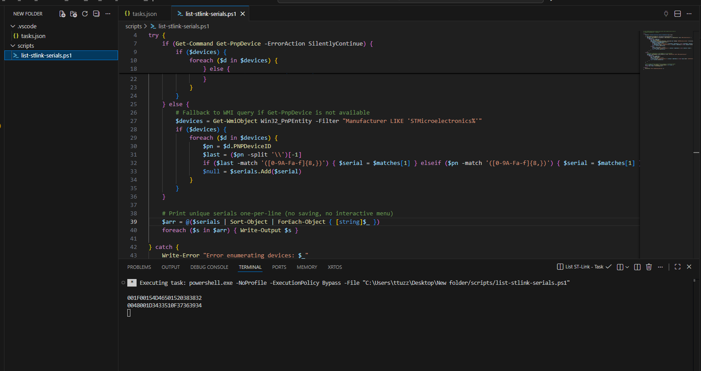

# ST-Link Seri Numarası Tarayıcı



Bu küçük araç, bilgisayarınıza bağlı STMicroelectronics (ST-Link) cihazlarını tarar ve her bir cihaz için seri numarası benzeri kimlikleri tek satır halinde yazdırır.

Özet
- Script: `scripts/list-stlink-serials.ps1` — ST-Link cihazlarını listeler ve her seri numarasını bir satırda yazdırır.
- VS Code görev: `.vscode/tasks.json` içinde tanımlı görevi çalıştırarak terminalden de aynı çıktıyı alabilirsiniz.

Kullanım
1. Komut satırından çalıştırmak:

```powershell
powershell.exe -NoProfile -ExecutionPolicy Bypass -File ".\scripts\list-stlink-serials.ps1"
```

Çıktı örneği (her satır bir seri):

```
001F00154D46501520383832
0048001D3433510F37363934
```

2. VS Code'dan çalıştırmak:
- `Terminal -> Run Task...` → `List STMicroelectronics Devices with Parent (print serials)` görevini seçin.

Notlar
- Script yalnızca listeler; otomatik olarak dosyaya kaydetmez. (Daha önce kaydetme davranışı vardı; bu versiyon sadece yazdırır.)
- README içindeki `image.png` cihazların Device Manager'daki "Parent"/"Last known parent" alanını gösteren örnek görseldir. Bu dosyayı proje köküne koyup adını `image.png` yaparsanız görsel README içinde gösterilir.

Sorular veya özel format isteği varsa söyleyin; README'yi isteğinize göre güncellerim.
